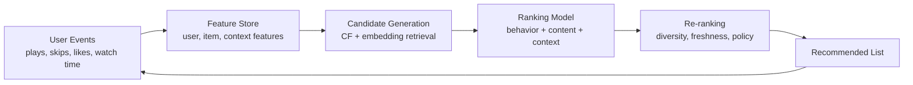

# One-Page Research Brief: How Streaming Platforms Predict What You Will Like Next

## Short Intro
Major streaming systems such as Spotify and YouTube use hybrid recommendation pipelines. They combine collaborative filtering (learning from behavior patterns across many users) with content-based filtering (learning from song or video attributes). In production, these methods are not used in isolation. They are combined in a multi-stage system that retrieves likely candidates and then ranks them with richer models.

## Collaborative vs Content-Based Filtering

| Topic | Collaborative Filtering | Content-Based Filtering |
|---|---|---|
| Plain-language idea | People similar to you liked this. | This item is similar to items you already like. |
| Core signal source | User-item interactions across many users | Item attributes and feature vectors |
| Common examples | Co-listens, playlist co-occurrence, likes/saves, skips, watch/listen duration | Genre, mood, tempo, energy, artist similarity, text/audio embeddings |
| Main strength | Strong discovery and serendipity | Better for new or less-interacted items |
| Main weakness | Cold start and popularity bias | Overspecialization (too much of the same vibe) |

## What Spotify and YouTube Seem to Rely On Most
- Spotify appears to emphasize a blend of behavior graph signals (listens, saves, playlist behavior) and rich music features (audio traits, metadata, and text/NLP cues).
- YouTube appears to emphasize large-scale behavioral modeling and deep learning for candidate generation and ranking, especially watch-time and satisfaction-oriented objectives.
- Both systems are hybrid and continuously updated from fresh interaction data.

## Core Data Types in Modern Recommenders
- User behavior: plays, replays, likes/dislikes, skips, saves, playlist adds, follows/subscriptions, search clicks, watch or listen time.
- Session context: time of day, recency sequence, device type, locale/language, entry point (home, search, autoplay).
- Item metadata: creator/artist, genre/category, release date, popularity trend.
- Content features: tempo (BPM), key, energy, mood or valence-like signals, lyrics/topics, multimodal embeddings.
- Optimization and constraints: retention/satisfaction proxies, diversity, novelty, freshness, policy and safety filters.

## How It Works End-to-End

## Limitations, Risks, and Mitigations
- Cold start: New users/items have sparse history. Mitigation: onboarding preferences, popularity priors, and content similarity.
- Popularity bias: Popular items get more exposure and become more popular. Mitigation: calibrated exposure and exploration.
- Filter bubbles: Recommenders may overfocus on one narrow taste profile. Mitigation: diversity and novelty constraints.
- Feedback loops: Model decisions shape future training data. Mitigation: random exploration and debiased evaluation.
- Objective mismatch: Click or watch optimization can reduce long-term satisfaction. Mitigation: optimize long-term quality and satisfaction proxies.

## References
1. Covington, Adams, Sargin (2016). Deep Neural Networks for YouTube Recommendations. ACM RecSys.
2. Davidson et al. (2010). The YouTube Video Recommendation System. ACM RecSys.
3. Spotify Research site (public publications and research areas on recommendations and user modeling): https://research.atspotify.com/
4. Spotify R&D Engineering hub: https://engineering.atspotify.com/
